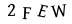
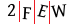

# Captcha Breaker

## What is it?
The Captcha Breaker is a tool that allows you to recognize a captcha text.

## How works?



1. Split the captcha into single letter.
2. convert image to grey color.
3. Use SVM model to train the captcha text.

## How to use it?

```python
import joblib

clf = joblib.load('captcha_breaker.pkl')
clf.predict('Single letter image data')
```